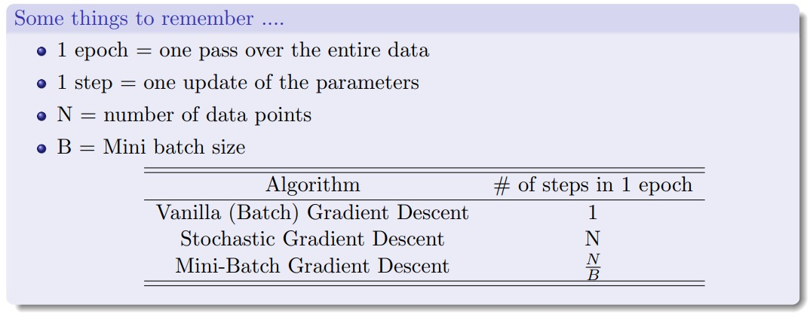

# Machine Learning 

## Envirnoment Setup
```bash
conda create -n ml python
conda activate ml
pip install -r requirements.txt
```

| S.No. | Topic                       | Notes                                      | Code                                      |Status |
|-------|-----------------------------|--------------------------------------------|-------------------------------------------|-------|
| 1     | Linear Regression (Matrix)  | [notes](notes/LinearRegresion.md)          | [code](src/linearRegressionClosedForm.py) | [X]   |
| 2     | Linear Regression (Gradient)| [notes](notes/LinearRegressionGradient.md) | [code](src/linearRegression.py)           | [ ]   |
| 3     | Logistic Regression         | [notes](notes/LogisticRegression.md)       | [code](src/logisticRegression.py)         | [ ]   |
| 4     | Naive Bayes                 | [notes](notes/NaiveBayes.md)               | [code](src/naiveBayes.py)                 | [ ]   |
| 5     | k-NN                        | [notes](notes/KNN.md)                      | [code](src/knn.py)                        | [ ]   |
| 6     | k-means                     | [notes](notes/KMeans.md)                   | [code](src/kmeans.py)                     | [ ]   |
| 7     | Clustering                  | [notes](notes/Clustering.md)               | [code](src/clustering.py)                 | [ ]   |
| 8     | PCA                         | [notes](notes/PCA.md)                      | [code](src/pca.py)                        | [ ]   |
| 9     | LDA                         | [notes](notes/LDA.md)                      | [code](src/lda.py)                        | [ ]   |
| 10    | SVM                         | [notes](notes/SVM.md)                      | [code](src/svm.py)                        | [ ]   |
| 11    | Decision Tree               | [notes](notes/DecisionTree.md)             | [code](src/decisionTree.py)               | [ ]   |
| 12    | Adaboost                    | [notes](notes/Adaboost.md)                 | [code](src/adaboost.py)                   | [ ]   |
| 13    | Random Forest               | [notes](notes/RandomForest.md)             | [code](src/randomForest.py)               | [ ]   |
| 14    | Boosting Trees              | [notes](notes/BoostingTrees.md)            | [code](src/boostingTrees.py)              | [ ]   |
| 15    | Perceptron                  | [notes](notes/Perceptron.md)               | [code](src/perceptron.py)                 | [ ]   |
| 16    | Neural Network              | [notes](notes/NeuralNetwork.md)            | [code](src/neuralNetwork.py)              | [ ]   |
| 17    | CNN                         | [notes](notes/CNN.md)                      | [code](src/cnn.py)                        | [ ]   |


# **Deep Neural Network** - 
Implementation of Deep Neural Network with all the basic operation from the scratch.

## Vanilla GD, SGD, Mini-Batch GD

  

# Resources
[CS7015: Deep Learning by Mitesh Khapra](http://cse.iitm.ac.in/~miteshk/CS7015_2018.html)
[AWESOME RNN](https://github.com/kjw0612/awesome-rnn)


